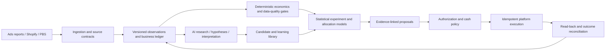
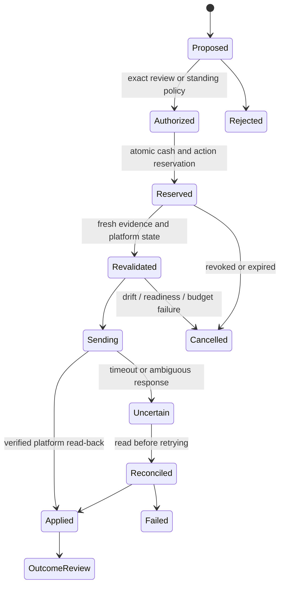

# System blueprint

## Product objective and scope

Build a shared operating system for product advertising and Amazon book advertising that maximizes **risk-adjusted incremental contribution within authorized client limits**. The platform should be able to discover that a campaign, product, or book cannot profitably acquire customers under current conditions and stop the search when its learning allowance is exhausted.

The September 2026 implementation is a local, single-operator foundation. The production architecture below is a delivery design, not a description of already deployed services. See [the roadmap](ROADMAP.md) for the boundary between implemented and planned work.

## 1. Separate the three jobs



**Measurement** establishes what is observed, what is missing, and how money flows. **Intelligence** proposes experiments and estimates uncertainty. **Execution** enforces authorization and platform-specific constraints. An LLM must not collapse these into one free-form prompt with account tokens attached.

The platform's own auction system still chooses delivery opportunities. Orbit operates above that layer: deciding experiments, business constraints, cross-campaign priorities within the same authorized budget pool, and when to pause, confirm, or expand a test.

## 2. Two domain models, one decision contract

| Concern                 | Products                                                     | Books                                                                     |
| ----------------------- | ------------------------------------------------------------ | ------------------------------------------------------------------------- |
| Stable entity           | Store + SKU + product variant                                | Publisher + book + ISBN/EAN + ASIN + format + marketplace                 |
| Revenue source of truth | Paid/refunded order ledger                                   | Contracted publisher receipts / author royalties / settlements            |
| Costs                   | Product, shipping, fulfillment, processing, returns, support | Print, distribution, fulfillment, returns, applicable publisher costs     |
| Availability            | Stock, route, delivery promise, exact SKU readiness          | Title/format eligibility, stock/availability, detail page, marketplace    |
| Main experiments        | Hook, creative package, format, audience, offer, page        | Automatic discovery, keywords/match types, ASIN targets, placements, bids |
| Feedback lag            | Click-to-order plus refund/return lag                        | Click attribution, shipping/returns, royalty and remittance lag           |
| Secondary outcomes      | Signup or qualified lead, separately valued                  | Page reads / read-through / other formats, separately estimated           |

Every proposal has the same envelope: client/account scope, evidence snapshot, model version, assumptions, uncertainty, intended change, maximum commitment, expiry, and allowed execution mode. Its economics calculation remains domain-specific.

## 3. Measurement before optimization

### Canonical observation grain

The production fact key should include:

```text
tenant_id + advertiser_account + marketplace + source_contract_version
+ reporting_date + campaign + ad_group/ad_set + target/creative
+ placement_breakdown + attribution_definition + reporting_time_basis
```

Never join rows by a campaign name alone in production. Native IDs, match type, entity version, account, currency, timezone, and reporting grain are part of identity. A keyword row and an ad-group total must not be added together.

Store both reporting time and ingestion time, the export/request ID, original source payload checksum, and source schema version. Re-pull the overlapping trailing window because attributed outcomes can change. Updates replace the same fact key and retain revision provenance.

Explicit zero and missing are different states. Late, partial, empty, throttled, incompatible, and successful sync results need distinct health statuses. Do not label an account healthy just because a scheduler process exited successfully.

### Business ledger

Use an independently reconciled ledger for net receipts and variable costs. Platform-attributed sales belong in a separate measurement layer. A platform purchase is not proof of incremental lift, and summing cross-channel attribution can double count.

For books, keep MANUFACTURING, CONSIGNMENT, Ads attribution, KDP royalties, and remittances as separate facts linked through book identity. Do not infer publisher earnings from all-vendor shipped COGS. Preserve a multi-ASIN map and flag ambiguous ownership rather than silently dropping alternative IDs.

For products, ingest and reconcile paid orders, discounts, refunds, chargebacks, fulfillment costs, stock, and consent-compatible attribution. Use webhook verification, a durable inbox, idempotency, and periodic source reconciliation.

All financial amounts have a currency and integer minor-unit or appropriate fixed-decimal representation. Cross-currency portfolios need documented FX rates, effective dates, and conversion rules. Version unit economics by item, format, contract, and effective date.

### Reporting comparability

Show settled vs provisional periods explicitly. Compare like-for-like coverage and attribution maturity. A daily spend figure can be current while its conversions are incomplete. A 28-day prior window with two available days is not a valid basis for a percentage improvement.

The initial app uses USD/UTC, static per-purchase economics, campaign/day aggregates, and a fixed click window. It checks complete comparison coverage. Extending those constraints is a schema/mapping task, not a dropdown-only UI change.

## 4. The learning loop

### A. Candidate generation

AI and deterministic tools produce candidate briefs with:

- Item/account and source evidence references.
- A falsifiable hypothesis, one primary outcome, and one declared changed variable.
- The controlled settings, sample/power plan, test/learning budget, and review date.
- Creative/keyword provenance, claims/relevance/rights status, and rejection reasons.
- Content hashes, destination version, targeting definition, and parent experiment.

For books, begin with actual metadata, subjects, description, reader intent, observed search terms, and relevant comparison titles. An LLM-generated ASIN is not a valid target: resolve and verify it against an authorized catalog source. Do not infer hidden book contents from a title.

For commerce, version actual creative assets and copy, retain original media evidence, and preserve product release gates. A generated product image is not evidence of real fitment or performance.

### B. Screening

Perform free checks before spending: duplicate/similarity clustering, unsupported claims, irrelevant targeting, policy/eligibility, broken destinations, unavailable stock, and impossible acquisition economics.

Use a small test wave with a per-wave loss allowance. Hundreds of queued ideas are useful; hundreds of simultaneously underfunded experiments can destroy signal. In an observational ad set, unequal delivery is part of the observation, not random assignment.

Primary diagnostic paths:

- Impressions → clicks: relevance, hook, placement, and delivery.
- Clicks → qualified visits: destination/loading/measurement quality.
- Visits → purchases: offer, price, evidence, availability, and page quality.
- Purchases → contribution: real receipts, costs, return rates, and acquisition cost.

Secondary metrics help diagnose the failure; they do not replace the primary economic outcome.

### C. Confirmation

Predeclare the control/challenger, exposure unit, success criterion, minimum economic effect, decision rule, duration, loss boundary, and maturity delay. Use native exclusive experiment arms or another validated design where feasible.

Handle repeated testing and multiple comparisons deliberately. Choose a supported sequential/Bayesian or frequentist design and evaluate its calibration. Do not append days until a desired result appears. Keep a valid “inconclusive” outcome.

Counterfactual lift requires a valid control, not a prettier before/after chart. Geo/audience holdouts and incrementality experiments become useful only with enough scale and platform support.

### D. Allocation

Rank by expected **marginal contribution** under uncertainty, not maximum average ROAS. An ad can have excellent historic ROAS but no additional demand at the next budget level.

At first, propose small bounded increments. Later compare constrained Thompson sampling, contextual/hierarchical models, and marginal response curves through offline replay and shadow mode. Segment priors by relevant domain and exposure definition; calibrate against held-out outcomes. Model drift, fatigue, stock, bid inflation, seasonality, and delayed conversions.

Hard constraints include client cash/loss limits, account currency, per-item inventory, campaign/wave commitments, maximum bid and daily change, cooldown, experiment controls, and platform limits. Never transfer one client's budget to another without explicit authorization for a shared pool.

The spend optimizer must allow “allocate nothing more.” It must also price information: exploratory spend earns the opportunity to learn, not an assumed future profit.

### E. Memory

Save the proposal, evidence digest, authorization, execution result, post-action observations, and reviewed outcome. A lesson includes applicability and limitations. Carrying a promising hook from one product or publisher to another creates a new hypothesis, not inherited certainty.

## 5. Initial model: implemented and intentionally bounded

`server/engine.ts` computes contribution from verified per-purchase assumptions and returns null when economics are unverified. The current screening model uses:

```text
p(conversion | clicks) ~ Beta(1 + mature purchases, 19 + mature nonconverting clicks)
effective target CAC  = unit contribution - profit reserve - observed refunds per purchase
profit probability    = P(p > observed CPC / effective target CAC)
```

This prior has a 5% mean with 20 pseudo-clicks. It is an explicit starting assumption, not a universal advertising benchmark. The implementation computes beta tails with log-gamma and a bounded continued fraction, avoiding a loop over millions of conversions.

Current gates:

1. Valid economics, click-reporting attestation, and availability/evidence readiness.
2. Continuous reporting dates, a current export, and refreshed mature cohorts.
3. Exclude the most recent `attributionDays` complete cohorts and today's partial cohort.
4. At least seven mature reporting days and 100 clicks before performance screening.
5. A scale proposal additionally requires at least 20 mature purchases, positive modeled contribution, and modeled probability ≥95%.
6. A scale proposal is at most 20% above the recorded daily planning budget and no greater than the remaining total learning allowance.
7. A low probability plus sufficient mature spend produces a reduction review. Exhausting the learning allowance produces a stop/review regardless of favorable observed performance.

These are **configurable design defaults to evaluate**, not statistical proof or platform recommendations. The v0.1 implementation keeps them in code for transparency. Its counts assume at most one purchase per converting click and stable economics, and it does not model auction CPC uncertainty, correlated users, fatigue, placement mix, multi-item baskets, or causal lift. No allocation action executes.

The initial dashboard sums channel-attributed model estimates with an explicit overlap caveat. A future business-profit dashboard must use the deduplicated business ledger instead.

The implemented target explorer applies these observational gates to imported keyword, product-target, and creative-cell facts. It requires a healthy parent campaign and blocks interpretation if stored target totals exceed matching parent/day totals or lack a parent row. Target metrics are never added to campaign portfolio metrics. Partial target coverage remains possible and does not justify portfolio-wide attribution claims. A target can seed a new draft with its source ID retained; this is not automatic linkage to a randomized experiment arm.

## 6. Production execution and authority

Use staged operating modes scoped to each account:

| Mode                 | Authority                                                                               |
| -------------------- | --------------------------------------------------------------------------------------- |
| Observe              | Read approved data only                                                                 |
| Recommend            | Save proposed changes with evidence and reason                                          |
| Supervised execution | Execute an exact reviewed change set while its authorization is valid                   |
| Bounded automation   | Execute only preauthorized action classes within a versioned policy and budget envelope |

A standing bounded policy should not require repeated permission for actions already authorized within it. Crossing the envelope requires a new authorization. Store who authorized what, which accounts and spend pools it covers, when it expires, and how it is revoked.

Proposed action state machine:



Use a transaction/outbox pattern so a database commit and an external API request cannot silently diverge. An idempotency key should cover tenant, account, target, evidence/version, action type, and expected prior state. If the platform does not support native idempotency, maintain the ledger and read back before retrying uncertain writes.

Only the execution worker can access mutation credentials. Recheck current account configuration, commitment reservations, source health, policy version, and actual platform state immediately before sending. Do not let a queue of individually allowed proposals collectively exceed a budget.

Budget policy also accounts for platform daily-budget elasticity, overlapping native rules, bid multipliers, reporting delay, in-flight delivery, and failed pause requests. Reserve headroom. Monitoring and a kill switch reduce exposure; they cannot make a delayed external ad platform an exact real-time cash lock.

Changes need a compensating action and a read-back result. Restoring an earlier bid does not undo spend or platform learning effects. A revoked credential, outage, stalled report, or unknown execution result should block increases and surface an incident.

## 7. Suggested service and storage shape

Start with a modular application and durable workers rather than many independently deployed microservices. Split when workload or ownership makes it useful.

| Component                    | Production responsibility                                                      |
| ---------------------------- | ------------------------------------------------------------------------------ |
| Web / API                    | Operator workflows, scoped authorization, reports, exact change previews       |
| Connector workers            | OAuth refresh, pagination, throttling, async report polling, overlap backfills |
| Measurement workers          | Normalize, deduplicate, reconcile, flag coverage, compute economics            |
| Experiment service           | Versions, hypotheses, cohort definitions, controls, outcomes                   |
| Intelligence workers         | Bounded evidence packets, AI jobs, statistical models, proposal generation     |
| Policy and execution workers | Atomic reservations, revalidation, platform actions, read-back                 |
| Job health                   | Watermarks, partial coverage, expired tokens, stalled jobs, backpressure       |

Suggested persistence:

- **PostgreSQL:** tenant/account/catalog relations, policy versions, normalized metrics, ledger, experiments, proposals, authorization, execution outbox, and audit references.
- **Object storage:** original reports, approved creative assets, evidence packets, report schemas, and immutable checksums with restricted access.
- **Durable queue/workflow engine:** rate-limited connector jobs, reporting polls, idempotent action processing, retries with jitter, dead-letter/incident queues.
- **Analytics store only when justified:** larger fact volumes and retention needs may warrant columnar storage later. Keep accounting authoritative in the ledger.

Proposed entity families: `tenant`, `membership`, `client`, `budget_pool`, `ad_account`, `connection`, `catalog_entity`, `book_identity`, `economics_version`, `campaign`, `target`, `creative_version`, `experiment`, `experiment_arm`, `source_contract`, `report_job`, `observation_revision`, `business_ledger_entry`, `evidence_snapshot`, `model_run`, `proposal`, `authorization`, `spend_reservation`, `execution_attempt`, `outcome_review`, `lesson`, `audit_event`.

Tenant IDs must be enforced in both application authorization and database access policies. Dataset separation in the local demo is **not** production tenant security. Authenticated API requests, background jobs, object-storage keys, exports, and LLM evidence packets all require the same scope boundary.

## 8. Connector contracts

Amazon Ads, Meta, TikTok, Shopify, and PBS integrations should expose explicit capabilities, not pretend every platform has the same targeting, attribution, budget, or experiment primitives.

Every connector needs: supported versions/regions, account discovery, authorization lifecycle, scope and refresh state, resource enumeration, report definitions, reconciliation logic, rate-limit handling, freshness expectations, error classification, and a read-only default.

Before mutation support, validate the requested operation against actual account capability. Use contract fixtures redacted from authorized accounts, not invented response schemas. Keep source-specific attributes alongside normalized fields rather than throwing away distinctions needed for future decisions.

Amazon Ads application approval, client OAuth/profile scoping, and reporting are the first Amazon integration milestones. PBS SP-API credentials remain separate. The first product milestones are authorized Meta Insights and Shopify reconciliation. Build both tracks concurrently in delivery priority, without requiring separate agents.

## 9. AI operations and evaluation

Models can draft briefs, propose relevant keywords, cluster search terms, interpret evidence, and suggest a next controlled variable. They cannot manufacture outcome numbers, change financial truth, approve their own costs, or execute platform writes from prose.

Use structured outputs, validated references, and a bounded action vocabulary. Inputs are untrusted, including campaign names and old analyst notes. Minimize customer data sent to providers. Keep credentials outside prompts and browser bundles. Version prompts, model configuration, schemas, and evidence.

The production AI ledger should reserve estimated maximum cost using verified prices and token estimates, then reconcile reported usage and invoices. The initial app implements a durable daily request allowance only; it does not claim invoice-accurate dollar budgeting.

Evaluate at least: factual grounding, reference validity, unsupported claims, duplicate ideas, relevance, abstention when data is missing, adherence to allowed actions, prompt-injection resistance, latency, and cost. Keep numerical acceptance tests outside LLM prose.

## 10. Validation before autonomy

- Reconcile imports and identity maps against original reports; prove correction/replay idempotency.
- Prove missing costs, stale reports, incompatible windows, and unavailable stock prevent increases.
- Exercise concurrent reservations, duplicate jobs, rate limits, token expiry, provider timeouts, ambiguous writes, revocation, and read-back failures.
- Backtest with time-ordered data without leaking future conversions. Include losing, sparse, and seasonal campaigns.
- Run a shadow period: store proposals and compare them with operator decisions and later mature outcomes.
- Confirm economic lift using a suitable control where practical; do not equate higher attributed ROAS with incremental profit.
- Enable a narrow supervised pilot, then bounded automation only after its policy and recovery behavior are demonstrated.

The software can improve search, measurement, and decision discipline. It cannot guarantee profitable demand for every product or book.
